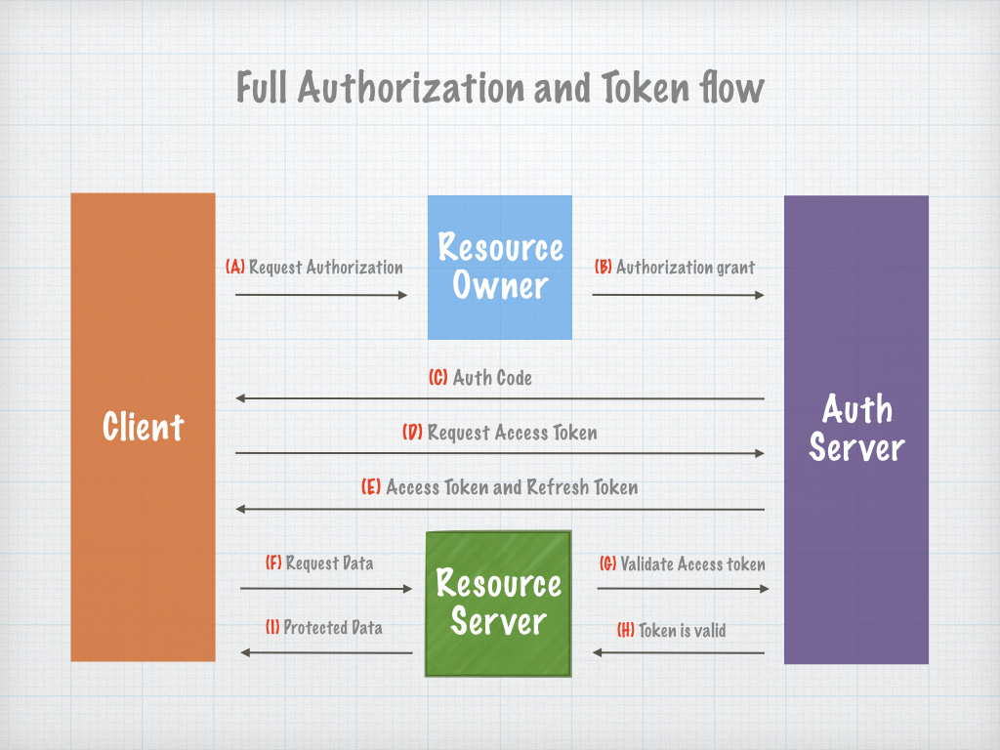
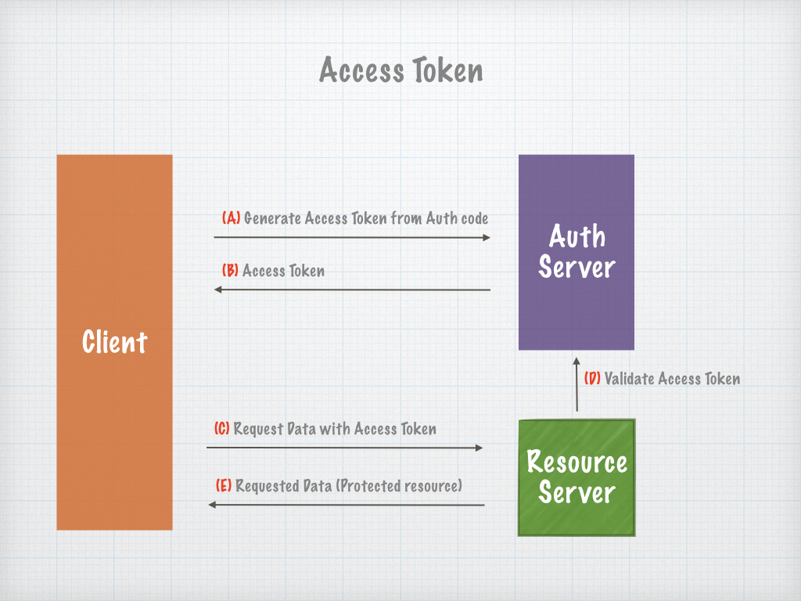

SimplyLink Auth Server
====================


# Access Token:

To integrate securely to SimplyLink resources, you will need to generate Access Tokens. 
Access Tokens are unique for a specific Owner (the entity that own the resource)  and to specific Scopes (resource data collections). 
Tokens are limited for a time frame and should not be generated a new tokens if another token is still useful. 
Please see the reference for saving tokens and reuse it with SimplyLink Auth SDK. 


### Access Token Endpoint

#### Request: 

> url: /oauth/v2/token

> POST (x-www-form-urlencoded)

```
{
    client_id: 1_xxxxxx
    client_secret: xxxx
    grant_type: xxxxxxx
    scope: xxxxxxxxxxxx (OPTIONAL)
}
```
 

#### Response: 

```
{
    "access_token": "xxxxxx",
    "expires_in": 3600,
    "token_type": "xxxxxxxx",
    "scope": "xxxxxxxxxxxxx",
    "refresh_token": "xxxxx"
}
```


Fields spec:
     
| Field             | Type     | Description  |
| ----------------- |:--------:|:------------ |
| access_token      | string   | A token used to access protected resources.  |
| expires_in        | int      | Seconds left until token will expire        |
| token_type        | string   | Type of the token        |
| scope             | string   | A permission for specific resources    |
| refresh_token     | string   | A token used to generate new access token after the previous token has expired         |


### Terminate Access Token

#### Request: 

> url: /oauth/v2/terminate

> Headers: Authorization=Bearer xxxxxxxx

> POST (x-www-form-urlencoded)

```
{
    client_id: 1_xxxxxx
    client_secret: xxxx
}
```
 

#### Response: 

```
{
    "success": "true",
    "data": [],
    "errors": []
}
```





