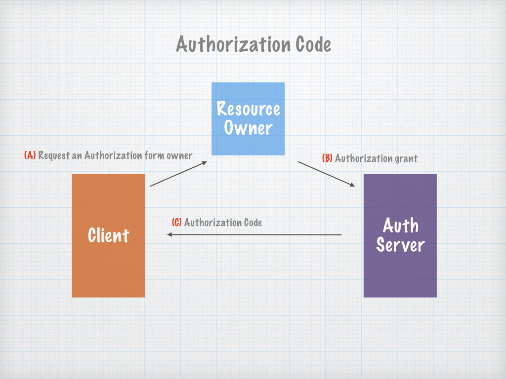

SimplyLink Auth Server
====================


# Authorization code:

Auth code are limited Authorization from the owner to a resource limited by scopes and time frame. 
Auth code allow a Client to create Access Token and refresh token. These tokens can be generated only once for each Auth code. If Auth code is being used more then once, all the tokens related and the auth code are being disabled. This restriction is for security reasons. 


### Authorization Endpoint

#### Request: 

> url: /oauth/v2/auth

> GET (query parameters)

```
{
    client_id: 1_xxxxxx
    return_uri: https://xxxx
    response_type: code
    scope: xxxxxxxxxxxx (OPTIONAL)
    state: xxxxxxxxxxxx (OPTIONAL)
}
```
 

#### Response: 

Redirect back to _return_uri_ parameter with query parameters: 

```
{
    "code": "xxxxxx"
}
```

The code on callback define


Fields spec:
     
| Field             | Type     | Description  |
| ----------------- |:--------:|:------------ |
| code              | string   | Auth code approved by the owner |




