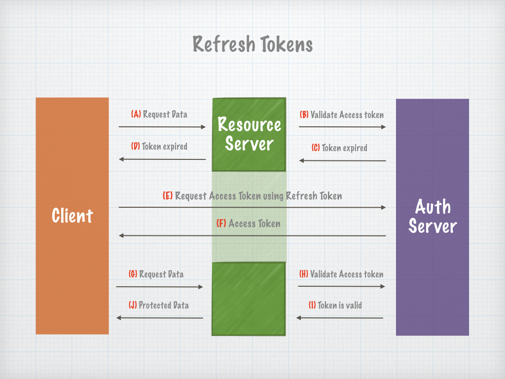

Simplylink Auth Server
====================


# Refresh Token:

Is limited for a longer time frame and can be used to generate new Access Tokens as mush as you need, as long as the Refresh Token is still valid.

### Refresh Token Endpoint

#### Request: 

> url: /oauth/v2/token

> POST (x-www-form-urlencoded)

```
{
    client_id: 1_xxxxxx
    client_secret: xxxx
    grant_type: xxxxxxx
    scope: xxxxxxxxxxxx (OPTIONAL)
    refresh_token: xxxx
}
```
 

#### Response: 

```
{
    "access_token": "xxxxxx",
    "expires_in": 3600,
    "token_type": "xxxxxxxx",
    "scope": "xxxxxxxxxxxxx",
    "refresh_token": "xxxxx"
}
```


Fields spec:
     
| Field             | Type     | Description  |
| ----------------- |:--------:|:------------ |
| access_token      | string   | A token used to access protected resources.  |
| expires_in        | int      | Seconds left until token will expire        |
| token_type        | string   | Type of the token        |
| scope             | string   | A permission for specific resources    |
| refresh_token     | string   | A token used to generate new access token after the previous token has expired         |



